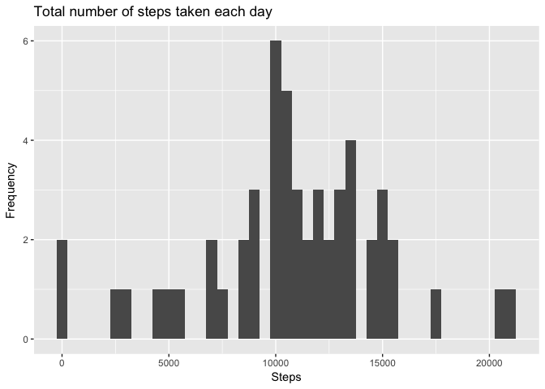
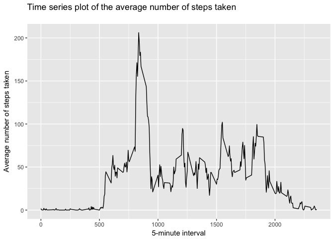
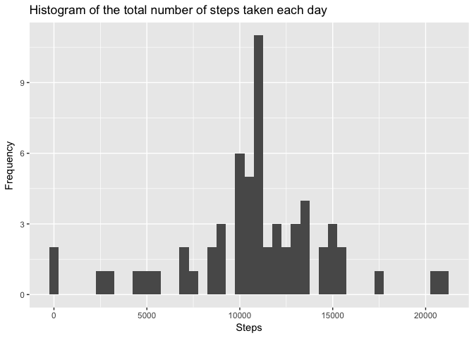
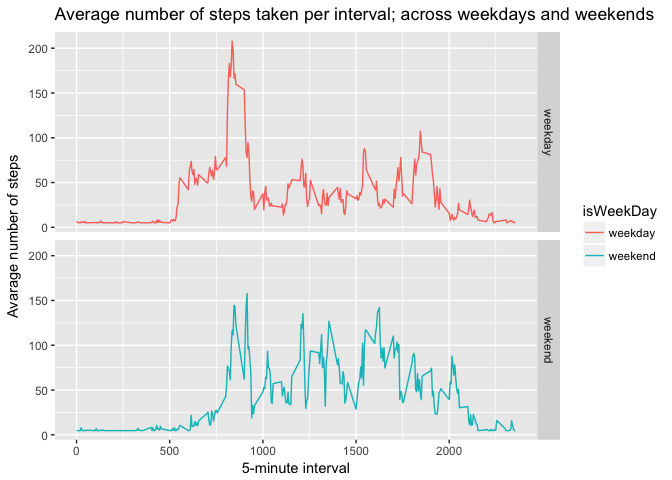

## Loading and preprocessing the data
##### 1. Load the data (i.e. read.csv())


```r
library(ggplot2)
library(scales)
library(Hmisc)
```

```
## Loading required package: lattice
```

```
## Loading required package: survival
```

```
## Loading required package: Formula
```

```
## 
## Attaching package: 'Hmisc'
```

```
## The following objects are masked from 'package:base':
## 
##     format.pval, units
```

```r
library(lubridate)
```

```
## 
## Attaching package: 'lubridate'
```

```
## The following object is masked from 'package:base':
## 
##     date
```

```r
options(scipen=999)

if(!file.exists('./activity.csv')){
    unzip('./activity.zip')
}
activity <- read.csv('./activity.csv')
```

##### 2. Process/transform the data (if necessary) into a format suitable for analysis

* No preprocessing/transformation of data is needed in this project.

-----

## What is mean total number of steps taken per day?
##### 1. Calculate the total number of steps taken per day

```r
stepsPerDay <- aggregate(activity$steps, by = list(activity$date), sum)
names(stepsPerDay) = c("Date", "TotalSteps")
```

##### 2. Make a histogram of the total number of steps taken each day

```r
ggplot(stepsPerDay, aes(x = TotalSteps)) + geom_histogram(binwidth = 500) + labs(title = "Total number of steps taken each day", x = "Steps", y = "Frequency")
```

```
## Warning: Removed 8 rows containing non-finite values (stat_bin).
```

<!-- -->

##### 3. Calculate and report the mean and median total number of steps taken per day

```r
stepsPerDayMean <- mean(stepsPerDay$TotalSteps, na.rm = TRUE)
stepsPerDayMedian <- median(stepsPerDay$TotalSteps, na.rm = TRUE)
```
* Mean number of steps taken per day: 10766.1886792
* Median number of steps taken per day:  10765

-----

## What is the average daily activity pattern?

```r
averageStepsPerTimeBlock <- aggregate(x = list(avgSteps = activity$steps), by=list(interval = activity$interval), FUN = mean, na.rm = TRUE)
```

##### 1. Make a time series plot of the 5-minute inteval and the average number of steps taken, averaged across all days

```r
ggplot(data = averageStepsPerTimeBlock, aes(x = interval, y = avgSteps)) + geom_line() + labs(title = "Time series plot of the average number of steps taken
", x = "5-minute interval", y = "Average number of steps taken") 
```

<!-- -->

##### 2. Which 5-minute interval, on average across all the days in the dataset, contains the maximum number of steps?

```r
maxStepsInterval <- averageStepsPerTimeBlock[which.max(averageStepsPerTimeBlock$avgSteps),]$interval
```

* The 5-minute interval that, on average, contains the maximum number of steps: 835

----

## Imputing missing values
##### 1. Calculate and report the total number of missing values in the dataset 

```r
numMissingValues <- length(which(is.na(activity$steps)))
```

* Number of missing values: 2304

##### 2. Devise a strategy for filling in all of the missing values in the dataset.

* Strategy: Mean step of the day is to be used. (Code for imputing missing data - shown in next part)

##### 3. Create a new dataset that is equal to the original dataset but with the missing data filled in.

```r
activityImputed <- activity
activityImputed$steps <- impute(activity$steps, fun = mean)
```


##### 4. Make a histogram of the total number of steps taken each day and Calculate and report the mean and median total number of steps taken per day. 

```r
stepsPerDayImputed <- aggregate(activityImputed$steps, by = list(activityImputed$date), sum)

names(stepsPerDayImputed) = c("Date", "TotalSteps")

ggplot(stepsPerDayImputed, aes(x = TotalSteps)) + geom_histogram(binwidth = 500) + labs(title = "Histogram of the total number of steps taken each day", x = "Steps", y = "Frequency")
```

<!-- -->


```r
stepsPerDayMeanImputed <- mean(stepsPerDayImputed$TotalSteps)
stepsPerDayMedianImputed <- median(stepsPerDayImputed$TotalSteps)
```
* Mean (Imputed): 10766.1886792
* Median (Imputed):  10766.1886792


----

## Are there differences in activity patterns between weekdays and weekends?
##### 1. Create a new factor variable in the dataset with two levels - "weekday" and "weekend" indicating whether a given date is a weekday or weekend day.


```r
activityImputed$isWeekDay <- ifelse(weekdays(ymd(activityImputed$date)) %in% c("Saturday", "Sunday"), 'weekend', 'weekday')
```

##### 2. Make a panel plot containing a time series plot


```r
averagedActivityImputed <- aggregate(activityImputed$steps, by = list(activityImputed$isWeekDay, activityImputed$interval), mean)
names(averagedActivityImputed) = c("isWeekDay", "interval", "steps")

ggplot(averagedActivityImputed, aes(x = interval, y = steps, color = isWeekDay)) + geom_line() + facet_grid(isWeekDay ~ .) + labs(title = "Average number of steps taken per interval; across weekdays and weekends", x = "5-minute interval", y = "Avarage number of steps")
```

<!-- -->
